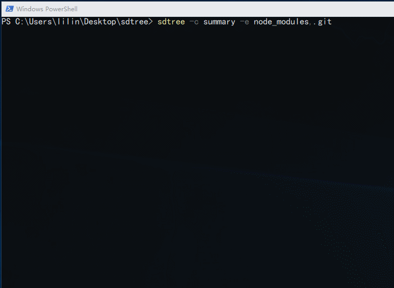

# sdtree （scan dir tree）目录树扫描工具

## 功能
### * 获取目录树字符串表示，可以附带指定文件注释
### * 获取目录树json格式

## 命令行

*首先要安装该工具，执行 npm install sdtree -g*

命令行参数：
>-i, --input    \<input>      扫描目录路径, 缺省为当前目录 
>-o, --output   \<output>     目录树输出文件 
>-c, --comment  \<comment>    要提取的文件注释名字 
>-e, --excludes \<exculudes>  忽略文件/目录;多个请使用半角逗号分隔，之间不能有空格

示例： 
$ sdtree -c summary -e node_modules,.git

## js调用

* getDirTree(path[,options]) *
. options {exclude: [], comment: ""}

>>