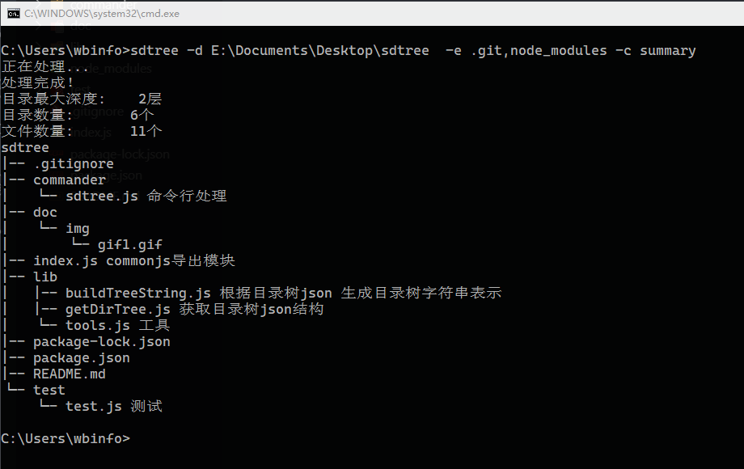

# sdtree （scan dir tree）目录树扫描工具

## 功能
* 获取目录树字符串表示，可以附带指定文件注释
* 获取目录树json格式

## 命令行

*首先要安装该工具，执行 npm install sdtree -g*

命令行参数：
>-d, --input    \<dir>        扫描目录路径, 缺省为当前目录<br>
>-o, --output   \<output>     目录树输出文件, 缺省会吧目录树信息打印到屏幕<br>
>-c, --comment  \<comment>    要提取的文件注释名字<br>
>-e, --excludes \<exculudes>  忽略文件/目录; 多个请使用半角逗号分隔，之间不能有空格

示例：<br>
$ sdtree -e .git,node_modules -c summary



## nodejs调用(api)

获取目录树字符串表示<br>
*getTreeStr(path[,options])*<br>
. options {exclude: [], comment: ""}
```js
const
sdtree = require("sdtree"),
str = sdtree.getTreeStr("./dirpath", {exclude:["node_modules"], comment: "summary"});

console.log(str); 
```

获取目录树json结构<br>
*getTreeJson(path[,options])*<br>
. options {exclude: [], comment: ""}
```js
const 
sdtree = require("sdtree"),
res = sdtree.getTreeJSON("./dirpath", {exclude:["node_modules"], comment: "summary"});

console.log(res.tree);
```

>>